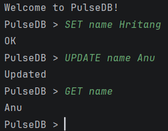
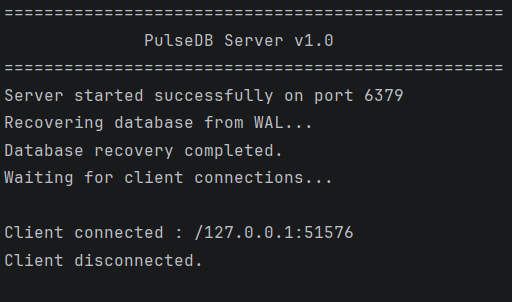
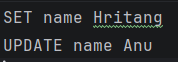

# PulseDB

A lightweight concurrent in-memory key-value database built in Java with TCP networking, thread-pool based concurrency, and Write-Ahead Logging (WAL) for durability.

---

## Features

* Concurrent TCP server supporting multiple clients
* Thread pool using `ExecutorService`
* In-memory storage using `ConcurrentHashMap`
* Write-Ahead Log (WAL) based persistence
* Automatic recovery on server startup
* Modular command-processing pipeline
* Lightweight custom text protocol

---

## Supported Commands

| Command            | Description                 |
| ------------------ | --------------------------- |
| `SET key value`    | Store a key-value pair      |
| `GET key`          | Retrieve a value            |
| `UPDATE key value` | Update an existing key      |
| `DELETE key`       | Remove a key                |
| `EXISTS key`       | Check if a key exists       |
| `COUNT`            | Return total number of keys |
| `KEYS`             | List all keys               |
| `CLEAR`            | Remove all entries          |
| `EXIT`             | Disconnect the client       |

---

## Architecture

```text
Client
   │
   ▼
ClientHandler
   │
   ▼
RequestParser
   │
   ▼
CommandDispatcher
   │
   ▼
StorageEngine
   │
   ├── ConcurrentHashMap
   └── WriteAheadLog (wal.log)
```

---

## Project Structure

```
src/main/java/com/hritang/pulsedb
│
├── client
├── command
├── config
├── model
├── persistence
├── server
└── storage
```

---

## Tech Stack

* Java 21
* Maven
* TCP Sockets
* ExecutorService
* ConcurrentHashMap
* Git & GitHub

---

## How to Run

```bash
git clone https://github.com/Hritang/PulseDB.git
cd PulseDB
mvn compile
```

Start the server first, then run the client.

---

## Example

```
PulseDB > SET name Hritang
OK

PulseDB > GET name
Hritang

PulseDB > UPDATE name Google
Updated

PulseDB > GET name
Google
```

---

## Persistence

PulseDB uses a lightweight Write-Ahead Log (WAL). Every mutating command is appended to `wal.log`. When the server restarts, the log is replayed to reconstruct the in-memory database automatically.

---

## Future Improvements

* Key expiration (TTL)
* Log compaction / checkpointing
* Transactions
* Authentication
* Benchmark suite
* Unit and integration tests

---
## Screenshots

### Client



### Server



### Write-Ahead Log



---

## Author

**Hritang Sugandh**
